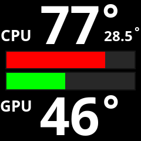

# AUR Package Instructions

## ⚠️ **BETA SOFTWARE WARNING**

**This package is in early development stage!**
- Currently tested only on developer's NZXT Kraken 2023
- Features may change or break without notice
- Use at your own risk and report issues


*Current LCD output on NZXT Kraken 2023*

## Files for AUR Publication

This directory contains the necessary files for publishing LCD AIO CAM to the Arch User Repository (AUR):

### Core Files:
- `PKGBUILD` - Main package build script for AUR
- `aiolcdcam.install` - Post-installation scripts and user instructions
- `.SRCINFO` - Generated metadata file for AUR (auto-generated from PKGBUILD)

## Publishing to AUR

### 1. Prepare AUR Repository
```bash
# Clone AUR repository (empty at first)
git clone ssh://aur@aur.archlinux.org/aiolcdcam.git aur-aiolcdcam
cd aur-aiolcdcam

# Copy files from main project
cp ../aiolcdcam/PKGBUILD .
cp ../aiolcdcam/aiolcdcam.install .

# Generate .SRCINFO
makepkg --printsrcinfo > .SRCINFO
```

### 2. Update Version and Checksums
```bash
# For new releases, update PKGBUILD:
# - pkgver=X.X.X
# - sha256sums=(run 'makepkg -g' to generate)

# Generate new checksums
makepkg -g
```

### 3. Configure UUID and Test Package Locally

**CRITICAL: Configure UUID BEFORE building!**

```bash
# STEP 1: Configure device UUID (REQUIRED)
sudo systemctl start coolercontrold
curl http://localhost:11987/devices | jq
nano include/config.h  # Set KRAKEN_UID to your device UUID

# STEP 2: Test build process (automatic cleanup included)
makepkg -s

# STEP 3: Test installation
sudo pacman -U aiolcdcam-1.25.07.08.2234-1-x86_64.pkg.tar.zst

# STEP 4: Test functionality
aiolcdcam --help
sudo systemctl status aiolcdcam.service
```

### 4. Publish to AUR
```bash
# Add all files
git add PKGBUILD aiolcdcam.install .SRCINFO

# Commit with meaningful message
git commit -m "Initial release 1.25.07.08.2234 - LCD AIO CAM daemon for NZXT Kraken"

# Push to AUR
git push origin master
```

## Package Features

### Dependencies:
- **Runtime**: cairo, libcurl-gnutls, coolercontrol
- **Build**: gcc, make, pkg-config
- **Optional**: nvidia-utils (GPU monitoring), lm_sensors (additional sensors)

### Installation:
- **Binary**: `/opt/aiolcdcam/bin/aiolcdcam` + symlink to `/usr/bin/aiolcdcam`
- **Source**: Complete source code in `/opt/aiolcdcam/` for UUID reconfiguration
- **Service**: systemd service file for automatic startup
- **Documentation**: man page, README, changelog

### Post-Installation:
- **Automatic Cleanup**: PKGBUILD automatically detects and removes conflicting manual installations
- **UUID Configuration**: Automatic instructions for device UUID setup
- **CoolerControl Integration**: Dependency verification and setup guidance
- **Service Management**: systemd service setup and upgrade handling
- **Configuration Preservation**: Source code included for post-installation UUID reconfiguration

## Local Testing Instructions

**IMPORTANT: Configure UUID BEFORE building the package!**

```bash
# 1. FIRST: Configure your device UUID
# Start CoolerControl
sudo systemctl start coolercontrold

# Find your device UUID
curl http://localhost:11987/devices | jq

# Edit config.h and set your UUID
nano include/config.h
# Replace KRAKEN_UID with your actual device UUID

# 2. THEN: Build and install the package (with automatic cleanup)
makepkg -si

# The build process will:
# 1. Detect existing manual installations
# 2. Automatically run 'sudo make uninstall' 
# 3. Clean up any conflicts
# 4. Proceed with PKGBUILD installation
```

## Automatic Conflict Resolution

The PKGBUILD now includes intelligent conflict detection:

- **Detection**: Automatically finds manual installations via Makefile
- **Cleanup**: Runs `sudo make uninstall` to cleanly remove conflicts
- **Fallback**: Manual cleanup if make uninstall fails
- **Transparency**: Detailed progress messages during cleanup
- **Safety**: Only removes conflicting installations, preserves user data

## Notes

- The package installs to `/opt/aiolcdcam/` following Arch Linux standards for third-party software
- A symlink in `/usr/bin/aiolcdcam` provides system-wide access
- Source code is included for post-installation UUID configuration
- The package properly handles systemd service management and cleanup
