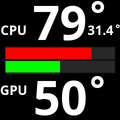

# LCD AIO CAM - For CoolerControl

[](LICENSE)
[](https://en.wikipedia.org/wiki/C99)
[](https://kernel.org/)
[](https://github.com)
[](bitcoin:13WjpWQMGG5sg3vTJJnCX3cXzwf2vZddKo)
[](https://dogechain.info/address/DRSY4cA8eCALn819MjWLbwaePFNti9oS3y)

## 📖 Description

**Take full control of your AIO liquid cooling system with integrated LCD display to monitor real-time sensor data in style.**

This high-performance, modular C-based daemon empowers you to harness the potential of your LCD-equipped AIO liquid coolers. Display comprehensive system monitoring data including CPU, GPU, and coolant temperatures directly on your LCD screen through seamless CoolerControl API integration.

Transform your cooling system into an intelligent monitoring hub that keeps you informed about your system's vital signs at a glance.

**🔧 Built with strict C99 compliance** for maximum portability and standards conformance.

---

## ⚠️ **BETA SOFTWARE - EARLY DEVELOPMENT STAGE**

> **🚧 This software is in very early development stage!**  
> - Features may change or break without notice
> - Bugs and issues are expected
> - **Currently tested only on developer's system with NZXT Kraken 2023**
> - **Command-line focused** - GUI configuration interface planned
> - Use at your own risk and please report any issues
> - Contributions and feedback are highly appreciated!

### 🔮 **Planned User Experience Improvements:**
- **🎛️ Configuration GUI**: Graphical interface for advanced settings configuration
- **📄 User-friendly .conf file**: Replace config.h editing with `/etc/aiolcdcam/aiolcdcam.conf` file
- **📱 System tray integration**: Easy mode switching and status monitoring
- **🎨 Theme system**: Visual customization of LCD displays
- **📊 Advanced monitoring**: Additional sensor data and customizable layouts

### 📸 **Screenshot - Current LCD Output:**

*Live temperature monitoring on NZXT AIO LCD display*

---

**👨‍💻 Author:** DAMACHINE ([christkue79@gmail.com](mailto:christkue79@gmail.com))  
**🧪 Tested with:** NZXT AIO Kraken 2023 (Z-Series) - Developer's personal system  
**🔗 Compatible:** NZXT AIO Kraken X-Series, Z-Series and other LCD-capable models *(theoretical)*

## ✨ Features

- **🏗️ Modular Architecture**: Professional separation of CPU, GPU, coolant, and display logic into separate modules
- **⚡ Performance-Optimized**: Caching, change detection, minimal I/O operations, mode-dependent resource usage
- **🔧 Automatic Device Detection**: Runtime UUID detection with persistent caching - no manual configuration required
- **💾 Smart UUID Caching**: First-run detection saves to `/var/cache/aiolcdcam/device.uuid` for instant subsequent startups
- **🎨 4 Display Modes**: From simple temperatures (def) to complex load diagrams (1-3)
- **🌐 Native CoolerControl Integration**: REST API communication without Python dependencies
- **📊 Efficient Sensor Polling**: Only necessary sensor data is queried depending on mode
- **🔄 Systemd Integration**: Professional service management with detailed logs
- **🚀 Intelligent Installation**: Automatic dependency detection and installation for all major Linux distributions

## 📦 Installation

### Prerequisites

1. **Install CoolerControl**: [Installation Guide](https://gitlab.com/coolercontrol/coolercontrol/-/blob/main/README.md)
2. **Start CoolerControl daemon**: `sudo systemctl start coolercontrold`
3. **Configure your LCD AIO** in CoolerControl GUI
4. **Set LCD to Image mode**: In CoolerControl GUI, set your AIO LCD display to "Image" mode

### Install LCD AIO CAM

#### Arch Linux (Recommended)

```bash
# STEP 1: Clone and configure UUID FIRST
git clone https://github.com/damachine/aiolcdcam.git
cd aiolcdcam

# STEP 2: Start CoolerControl daemon
# The AIO device UUID is now automatically detected at runtime and cached!
sudo systemctl start coolercontrold

# STEP 3: Build and install (includes automatic dependency management)
makepkg -si

# Option 2: Install from AUR (when published)
# yay -S aiolcdcam
# or
# paru -S aiolcdcam
```

#### Manual Installation (All Distributions)

```bash
# STEP 1: Clone repository
git clone https://github.com/damachine/aiolcdcam.git
cd aiolcdcam

# STEP 2: Start CoolerControl daemon
# The AIO device UUID is now automatically detected at runtime and cached!
sudo systemctl start coolercontrold

# STEP 3: Build and install (auto-detects Linux distribution and installs dependencies)
sudo make install

# STEP 4: Enable autostart
sudo systemctl enable aiolcdcam.service

# STEP 5: Start AIOLCDCAM
sudo systemctl start aiolcdcam.service
```

> **ℹ️ NEW**: Device UUID is now automatically detected at runtime and cached for instant subsequent startups! No manual configuration required.

### 💾 **UUID Caching System**

For optimal performance, the detected UUID is cached:
- **First run**: UUID detected via CoolerControl API
- **Cache saved**: UUID stored in `/var/cache/aiolcdcam/device.uuid`
- **Subsequent runs**: UUID loaded from cache for instant startup
- **Validation**: Cached UUID verified against current device list on each startup

**Supported Distributions (Auto-Detected):**
- **Arch Linux / Manjaro**: `pacman -S cairo libcurl-gnutls coolercontrol gcc make pkg-config`
- **Ubuntu / Debian**: `apt install libcairo2-dev libcurl4-openssl-dev gcc make pkg-config`
- **Fedora**: `dnf install cairo-devel libcurl-devel gcc make pkg-config`
- **RHEL / CentOS**: `yum install cairo-devel libcurl-devel gcc make pkg-config`
- **openSUSE**: `zypper install cairo-devel libcurl-devel gcc make pkg-config`

## ⚙️ Configuration

### Device Configuration (Automatic)

> **✅ NEW**: Device UUID is now **automatically detected** at runtime - no manual configuration required!

The daemon will:
1. **Connect to CoolerControl** daemon at startup
2. **Load cached UUID** from `/var/cache/aiolcdcam/device.uuid` (if available)
3. **Validate cached UUID** against current device list
4. **Auto-detect new UUID** if cache is invalid or missing
5. **Save detected UUID** to cache for future startups
6. **Display the active device** in the startup logs

**For troubleshooting**, you can manually check devices:
```bash
# Start CoolerControl (if not running)
sudo systemctl start coolercontrold

# Check available devices
curl http://localhost:11987/devices | jq
```

**Example CoolerControl API output:**
```json
{
  "8d4becb03bca2a8e8d4213ac376a1094f39d2786f688549ad3b6a591c3affdf9": {
    "name": "NZXT Kraken",
    "device_type": "Liquidctl",
    "type_index": 0
  }
}
```
> **💡 Note**: The daemon automatically finds and uses AIO devices with LCD capability.

### Display Modes

| Mode | Description | Sensor Data |
|------|-------------|-------------|
| `def` | Temperatures only (CPU, GPU, coolant) | Minimal I/O - temperatures only |
| `1`   | Temperatures + vertical load bars | All sensors + CPU/RAM/GPU load |
| `2`   | Temperatures + circular diagrams | All sensors + CPU/RAM/GPU load |
| `3`   | Temperatures + horizontal load bars | All sensors + CPU/RAM/GPU load |

> **🎨 Temperature Colors**: 4-stage gradient based on temperature:
> - **≤55°C**: 🟢 Green (cool)
> - **≤65°C**: 🟠 Orange (warm)  
> - **≤75°C**: 🔥 Hot Orange (hot)
> - **>75°C**: 🔴 Red (critical)

#### How to Change Display Mode

**Via systemd service (recommended):**
```bash
# Edit systemd service file
sudo systemctl edit aiolcdcam.service

# Add this content (example for mode 2):
[Service]
ExecStart=
ExecStart=/opt/aiolcdcam/bin/aiolcdcam 2

# Apply changes
sudo systemctl daemon-reload
sudo systemctl restart aiolcdcam.service
```

**Manual execution:**
```bash
# Stop service first
sudo systemctl stop aiolcdcam.service

# Run manually with desired mode
./aiolcdcam def      # Temperatures only
./aiolcdcam 1        # Vertical bars
./aiolcdcam 2        # Circular diagrams
./aiolcdcam 3        # Horizontal bars

# Or with --mode syntax
./aiolcdcam --mode 2
```

### Advanced Configuration

Edit `include/config.h` for customization:

```c
// Device settings (automatically detected at runtime)
// #define AIO_UUID "auto-detected"      // ✅ UUID is now automatically detected!
#define DAEMON_ADDRESS "http://localhost:11987"

// Display settings
#define DISPLAY_WIDTH 240
#define DISPLAY_HEIGHT 240
#define DISPLAY_REFRESH_INTERVAL_SEC 2

// Temperature thresholds (4-stage color gradient)
#define TEMP_THRESHOLD_GREEN 55.0f    // ≤55°C: Green
#define TEMP_THRESHOLD_ORANGE 65.0f   // ≤65°C: Orange  
#define TEMP_THRESHOLD_RED 75.0f      // ≤75°C: Hot Orange (>75°C: Red)
```

## 🔧 Usage & Tips

### Service Management

```bash
# Service control
sudo systemctl start aiolcdcam.service     # Start
sudo systemctl stop aiolcdcam.service      # Stop (displays face.png automatically)
sudo systemctl restart aiolcdcam.service   # Restart
sudo systemctl status aiolcdcam.service    # Status + recent logs

# Live logs
sudo journalctl -u aiolcdcam.service -f

# Makefile shortcuts
make start      # systemctl start aiolcdcam
make stop       # systemctl stop aiolcdcam
make status     # systemctl status aiolcdcam
make logs       # journalctl -u aiolcdcam -f
```

### Manual Usage

```bash
# Run manually (different modes) - both work after installation
aiolcdcam def      # System-wide command (via symlink)
aiolcdcam 1        # Vertical bars
aiolcdcam 2        # Circular diagrams  
aiolcdcam 3        # Horizontal bars

# Or use full path
/opt/aiolcdcam/bin/aiolcdcam def

# Alternative syntax
aiolcdcam --mode def
aiolcdcam --mode 2

# From project directory (before installation)
./aiolcdcam def
```

### Build Commands

```bash
make            # Standard C99 build
make clean      # Clean up
make install    # System installation with dependency auto-detection
make uninstall  # Remove installation (service, binary, files)
make debug      # Debug build with AddressSanitizer
make help       # Show all options
```

**C99 Compliance:**
- Compiled with `-std=c99` flag for strict standards conformance
- Uses `_POSIX_C_SOURCE 200112L` for POSIX compliance
- No GNU extensions or non-standard features

### Performance Notes

- **Mode "def"**: Only temperature sensors, minimal I/O (~3.4MB RAM, <1% CPU)
- **Modes 1-3**: Additional load data with intelligent caching (~3.5MB RAM, <2% CPU)
- **Sensor caching**: hwmon paths cached at startup, GPU data cached for 2 seconds
- **Change detection**: PNG only updated when significant changes occur

### System Requirements

- **OS**: Linux (hwmon support required)
- **CoolerControl**: Version 1.0+ (REQUIRED - must be installed and running)
- **CPU**: x86-64-v3 compatible (Intel Haswell+ 2013+ / AMD Excavator+ 2015+)
- **LCD**: LCD AIO displays supported by CoolerControl (NZXT AIO, etc.)
- **Resources**: < 5 MB RAM, < 1-2% CPU load

**For older CPUs**: Use `CFLAGS=-march=x86-64 make` for compatibility

## 🔍 Troubleshooting

### Common Issues

- **"Connection refused"**: CoolerControl daemon not running → `sudo systemctl start coolercontrold`
- **"Device not found"**: LCD AIO not configured in CoolerControl → Use CoolerControl GUI  
- **"Permission denied"**: Run with appropriate permissions → `sudo aiolcdcam def`
- **"Empty JSON response"**: No devices found → Check CoolerControl configuration and LCD AIO connection
- **"UUID not working"**: Wrong device UUID → Verify with `curl http://localhost:11987/devices | jq` and copy exact UUID

### Debugging Steps

```bash
# 1. Check CoolerControl status
sudo systemctl status coolercontrold
curl http://localhost:11987/devices

# 2. Test LCD AIO CAM manually
aiolcdcam def

# 3. Debug build for detailed information
make debug && aiolcdcam def

# 4. Check service logs
sudo journalctl -u aiolcdcam.service -f
```

### Finding Device UUID

```bash
# If curl command fails, ensure CoolerControl is running
sudo systemctl status coolercontrold
# If not running, start it:
sudo systemctl start coolercontrold

# Then try again
curl http://localhost:11987/devices | jq

# If no devices shown, check CoolerControl GUI configuration
# Your LCD AIO must be detected and configured in CoolerControl first

# Example of expected output:
curl http://localhost:11987/devices | jq
# Should show:
# {
#   "your-device-uuid-here": {
#     "name": "NZXT Kraken",
#     "device_type": "Liquidctl"
#   }
# }
```

## 📄 License

MIT License - See LICENSE file for details.

## 💝 Support the Project

If you find LCD AIO CAM useful and want to support its development:

### 🪙 Cryptocurrency Donations:
- **Bitcoin (BTC)**: `13WjpWQMGG5sg3vTJJnCX3cXzwf2vZddKo`
- **Dogecoin (DOGE)**: `DRSY4cA8eCALn819MjWLbwaePFNti9oS3y`

### 🤝 Other Ways to Support:
- ⭐ **Star this repository** on GitHub
- 🐛 **Report bugs** and suggest improvements  
- 🔄 **Share** the project with others
- 📝 **Contribute** code or documentation

> *All donations help maintain and improve this project. Thank you for your support!*

---

**👨‍💻 Developed by DAMACHINE for maximum efficiency, stability and professional code structure.**  
**📧 Contact:** [christkue79@gmail.com](mailto:christkue79@gmail.com)  
**📖 Manual:** `man aiolcdcam`  
**📍 Binary:** `/opt/aiolcdcam/bin/aiolcdcam` (also available as `aiolcdcam`)  
**💝 Donate:** BTC: `13WjpWQMGG5sg3vTJJnCX3cXzwf2vZddKo` | DOGE: `DRSY4cA8eCALn819MjWLbwaePFNti9oS3y`
