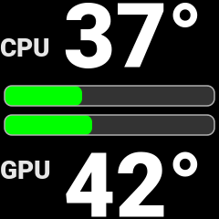

# CoolerDash - For CoolerControl

[](LICENSE)
[](https://en.wikipedia.org/wiki/C99)
[](https://kernel.org/)
[](bitcoin:13WjpWQMGG5sg3vTJJnCX3cXzwf2vZddKo)
[](https://dogechain.info/address/DRSY4cA8eCALn819MjWLbwaePFNti9oS3y)

## 📖 Description

**Take full control of your AIO liquid cooling system with integrated LCD display to monitor real-time sensor data in style.**

This high-performance, modular C-based daemon empowers you to harness the potential of your LCD-equipped AIO liquid coolers. Display comprehensive system monitoring data including CPU and GPU temperatures directly on your LCD screen through seamless CoolerControl API integration.

Transform your cooling system into an intelligent monitoring hub that keeps you informed about your system's vital signs at a glance.

---

### 📸 Screenshot – Example LCD Output

<div align="center">
  
  
</div>

*Left: Live temperature monitoring image on NZXT Kraken 2023 LCD display  
Right: AI-generated image to demonstrate LCD output*

**👨‍💻 Author:** DAMACHINE ([christkue79@gmail.com](mailto:christkue79@gmail.com))  
**🧪 Tested with:** NZXT AIO Kraken 2023 (Z-Series) - Developer's personal system  
**🔗 Compatible:** NZXT AIO Kraken X-Series, Z-Series and other LCD-capable models *(theoretical)*

## ✨ Features

- **🏗️ Modular Architecture**: Separation of CPU, GPU, coolant, and display logic into separate modules
- **⚡ Performance-Optimized**: Caching, change detection, minimal I/O operations
- **🔧 Automatic Device Detection**: Runtime UUID detection with persistent caching - no manual configuration required
- **💾 Smart UUID Caching**: First-run detection saves to `/var/cache/coolerdash/device.uuid` for instant subsequent startups
- **🎨 Display Modes (legacy)**: The program currently always runs in a fixed two-box layout (CPU/GPU temperature only). Mode selection is not available in this version. Support for selectable display modes (e.g. load bars, circular diagrams) may be reintroduced in a future version if there is sufficient demand.
- **🌐 Native CoolerControl Integration**: REST API communication without Python dependencies
- **📊 Efficient Sensor Polling**: Only necessary sensor data is queried (no mode logic)
- **🔄 Systemd Integration**: Service management with detailed logs
- **🚀 Intelligent Installation**: Automatic dependency detection and installation for all major Linux distributions
- **🔧 Built with strict C99 compliance** for maximum portability and standards conformance.

**Supported Distributions (Auto-Detected):**
- **Arch Linux / Manjaro**: `pacman -S cairo libcurl-gnutls coolercontrol gcc make pkg-config`
- **Ubuntu / Debian**: `apt install libcairo2-dev libcurl4-openssl-dev gcc make pkg-config`
- **Fedora**: `dnf install cairo-devel libcurl-devel gcc make pkg-config`
- **RHEL / CentOS**: `yum install cairo-devel libcurl-devel gcc make pkg-config`
- **openSUSE**: `zypper install cairo-devel libcurl-devel gcc make pkg-config`

## 📦 Installation

### Prerequisites

1. **Install CoolerControl**: [Installation Guide](https://gitlab.com/coolercontrol/coolercontrol/-/blob/main/README.md)
2. **Start CoolerControl daemon**: `sudo systemctl start coolercontrold`
3. **Configure your LCD AIO** in CoolerControl GUI
4. **Set LCD to Image mode**: In CoolerControl GUI, set your AIO LCD display to "Image" mode

### System Requirements

- **OS**: Linux (hwmon support required)
- **CoolerControl**: Version 1.0+ (REQUIRED - must be installed and running)
- **CPU**: x86-64-v3 compatible (Intel Haswell+ 2013+ / AMD Excavator+ 2015+)
- **LCD**: LCD AIO displays supported by CoolerControl (Asus, NZXT, etc.)
- **Resources**: < 4 MB RAM, < 1-2% CPU load

**For older CPUs**: Use `CFLAGS=-march=x86-64 make` for compatibility

### Install CoolerDash

#### Arch Linux (Recommended)

```bash
# STEP 1: Clone and configure UUID FIRST
git clone https://github.com/damachine/coolerdash.git
cd coolerdash

# STEP 2: Start CoolerControl daemon
# The AIO device UUID is now automatically detected at runtime and cached!
sudo systemctl start coolercontrold

# STEP 3: Build and install (includes automatic dependency management)
makepkg -si

# STEP 4: Enable autostart
sudo systemctl enable coolerdash.service

# STEP 5: Start CoolerDash service
sudo systemctl start coolerdash.service
```

#### Manual Installation (All Distributions)

```bash
# STEP 1: Clone repository
git clone https://github.com/damachine/coolerdash.git
cd coolerdash

# STEP 2: Start CoolerControl daemon
# The AIO device UUID is now automatically detected at runtime and cached!
sudo systemctl start coolercontrold

# STEP 3: Build and install (auto-detects Linux distribution and installs dependencies)
sudo make install

# STEP 4: Enable autostart
sudo systemctl enable coolerdash.service

# STEP 5: Start CoolerDash service
sudo systemctl start coolerdash.service
```

## ⚙️ Configuration
There is no configuration needed.
CoolerDash is pre-configured to use the default mode.

### Important customizable values from `include/config.h`

Below are the most important values you can adjust in `include/config.h` before building, to customize the display and behavior:

| Name                   | Default                | Description                                                      |
|------------------------|-----------------------|------------------------------------------------------------------|
| DISPLAY_WIDTH          | 240                   | LCD display width in pixels                                      |
| DISPLAY_HEIGHT         | 240                   | LCD display height in pixels                                     |
| DISPLAY_REFRESH_INTERVAL_SEC  | 2            | Display update interval (seconds)                                |
| TEMP_THRESHOLD_GREEN   | 55.0f                 | Temperature for green color (°C)                                 |
| TEMP_THRESHOLD_ORANGE  | 65.0f                 | Temperature for orange color (°C)                                |
| TEMP_THRESHOLD_RED     | 75.0f                 | Temperature for red color (°C)                                   |
| BOX_WIDTH              | 240                   | Width of each temperature box (pixels)                           |
| BOX_HEIGHT             | 120                   | Height of each temperature box (pixels)                          |
| FONT_SIZE_LARGE        | 98.0                  | Font size for temperature numbers                                |
| FONT_SIZE_LABELS       | 28.0                  | Font size for labels ("CPU", "GPU")                             |
| FONT_FACE              | "Roboto Black"        | Font used for all display text                                   |
| LCD_BRIGHTNESS         | 80                    | LCD brightness (0-100)                                           |
| LCD_ORIENTATION        | "0"                   | LCD orientation for image upload ("0"=default, "1"=rotated)      |
| GPU_CACHE_INTERVAL     | 2.5f                  | GPU data cache interval (seconds)                                |
| CHANGE_TOLERANCE_TEMP  | 0.1f                  | Minimum temperature change to trigger update (°C)                |
| IMAGE_PATH             | /opt/coolerdash/images/coolerdash.png | Path to generated display image                |

> **Tip:** Edit these values in `include/config.h` before running `make` to change the look, update interval, thresholds, or LCD behavior to your needs.

The daemon will:
1. **Connect to CoolerControl** daemon at startup
2. **Load cached UUID** from `/var/cache/coolerdash/device.uuid` (if available)
3. **Validate cached UUID** against current device list
4. **Auto-detect new UUID** if cache is invalid or missing
5. **Save detected UUID** to cache for future startups
6. **Display the active device** in the startup logs

**For troubleshooting**, you can manually check devices:
```bash
# Start CoolerControl (if not running)
sudo systemctl start coolercontrold

# Check available devices
curl http://localhost:11987/devices | jq
```

**Example CoolerControl API output:**
```json
{
      "name": "NZXT Kraken 2023",
      "type": "Liquidctl",
      "type_index": 1,
      "uid": "8d4becb03bca2a8e8d4213ac376a1094f39d2786f688549ad3b6a591c3affdf9",
      "lc_info": {
        "driver_type": "KrakenZ3",
        "firmware_version": "2.0.0",
        "unknown_asetek": false
      }
```
> **💡 Note**: The daemon automatically finds and uses AIO devices with LCD capability.

### Performance Notes

- **Mode** - Only temperature sensors, minimal I/O (~3.4MB RAM, <1% CPU)
- **Sensor caching**: hwmon paths cached at startup, GPU data cached for 2 seconds
- **Change detection**: PNG only updated when significant changes occur

## 🔍 Troubleshooting

### Common Issues

- **"Connection refused"**: CoolerControl daemon not running → `sudo systemctl start coolercontrold`
- **"Device not found"**: LCD AIO not configured in CoolerControl → Use CoolerControl GUI  
- **"Permission denied"**: Run with appropriate permissions → `sudo coolerdash def`
- **"Empty JSON response"**: No devices found → Check CoolerControl configuration and LCD AIO connection
- **"UUID not working"**: Wrong device UUID → Verify with `curl http://localhost:11987/devices | jq` and copy exact UUID

## Troubleshooting: Manual Installation Conflicts
If you see errors like "conflicting files" or "manual installation detected" during `makepkg -si`, this means CoolerDash was previously installed manually (via `make install`).

**Solution:**
- The PKGBUILD will attempt to clean up automatically.
- If problems persist, run:
  ```
  sudo make uninstall
  ```
- Remove any leftover files in `/opt/coolerdash/`, `/usr/bin/coolerdash`, and `/etc/systemd/system/coolerdash.service`.
- Then retry the installation.

If you need help, open an issue at https://github.com/damachine/coolerdash/issues

> **Note:** The program always runs in a fixed two-box layout (CPU/GPU temperature only). Mode selection is currently not available. Support for selectable display modes may be reintroduced in a future version if there is sufficient demand.

## 🔧 Usage & Tips

### Service Management

```bash
# Service control
sudo systemctl start coolerdash.service     # Start
sudo systemctl stop coolerdash.service      # Stop (displays face.png automatically)
sudo systemctl restart coolerdash.service   # Restart
sudo systemctl status coolerdash.service    # Status + recent logs

# Journal log
journalctl -xeu coolerdash.service

# Live logs
sudo journalctl -u coolerdash.service -f

# Makefile shortcuts
make start      # systemctl start coolerdash
make stop       # systemctl stop coolerdash
make status     # systemctl status coolerdash
make logs       # journalctl -u coolerdash -f
```

### Manual Usage

```bash
# Run manually (different modes) - both work after installation
coolerdash          # System-wide command (via symlink)

# Or use full path
/opt/coolerdash/bin/coolerdash

# From project directory (before installation)
./coolerdash
```

### Build Commands

```bash
make            # Standard C99 build
make clean      # Clean up
make install    # System installation with dependency auto-detection
make uninstall  # Remove installation (service, binary, files)
make debug      # Debug build with AddressSanitizer
make help       # Show all options
```

### Debugging Steps

```bash
# 1. Check CoolerControl status
sudo systemctl status coolercontrold
curl http://localhost:11987/devices

# 2. Test CoolerDash manually
coolerdash def

# 3. Debug build for detailed information
make debug && coolerdash def

# 4. Check service logs
sudo journalctl -u coolerdash.service -f
```

## 📄 License

MIT License - See LICENSE file for details.

## 💝 Support the Project

If you find CoolerDash useful and want to support its development:

### 🪙 Cryptocurrency Donations:
- **Bitcoin (BTC)**: `13WjpWQMGG5sg3vTJJnCX3cXzwf2vZddKo`
- **Dogecoin (DOGE)**: `DRSY4cA8eCALn819MjWLbwaePFNti9oS3y`

### 🤝 Other Ways to Support:
- ⭐ **Star this repository** on GitHub
- 🐛 **Report bugs** and suggest improvements  
- 🔄 **Share** the project with others
- 📝 **Contribute** code or documentation

> *All donations help maintain and improve this project. Thank you for your support!*

---

**👨‍💻 Developed by DAMACHINE for maximum efficiency and stability.**  
**📧 Contact:** [christkue79@gmail.com](mailto:christkue79@gmail.com)  
**📖 Manual:** `man coolerdash`  
**📍 Binary:** `/opt/coolerdash/bin/coolerdash` (also available as `coolerdash`)  
**💝 Donate:** BTC: `13WjpWQMGG5sg3vTJJnCX3cXzwf2vZddKo` | DOGE: `DRSY4cA8eCALn819MjWLbwaePFNti9oS3y`
